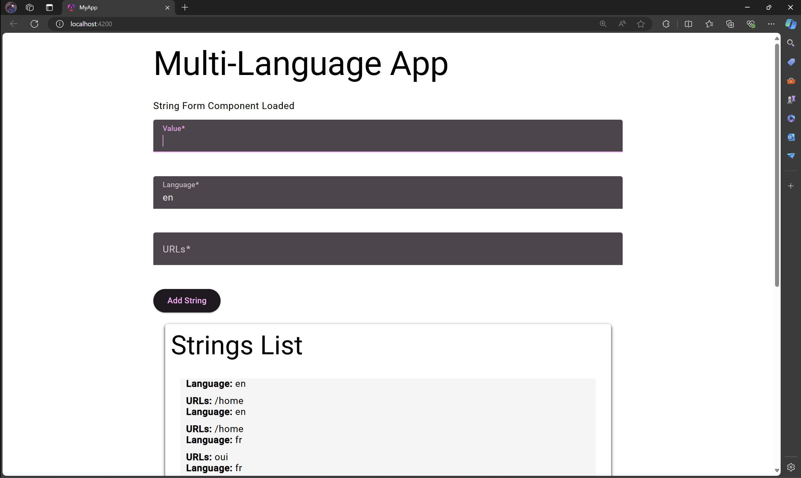
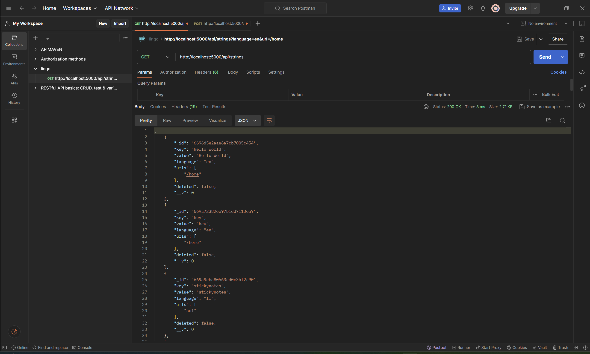
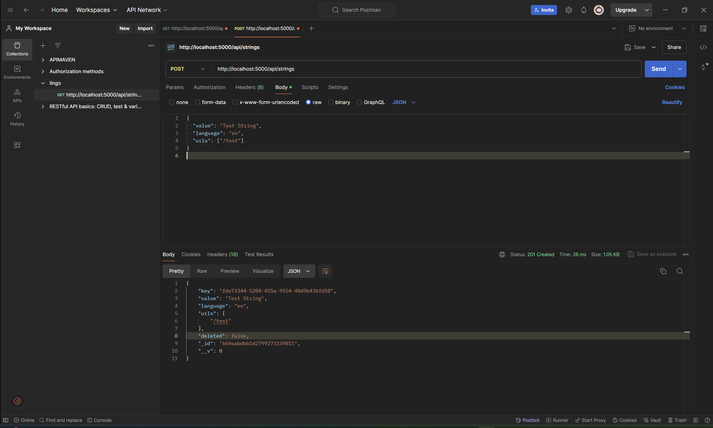

# LingoSwitch

The project aims to create a multi-language, dynamic web application with a centralized system for managing UI strings. This approach not only improves maintainability and scalability but also enhances the user experience by providing seamless language switching capabilities.
## Features

- Add new strings with associated language and URLs.
- View a list of all strings with their details.
- Manage strings (add, update, mark as deleted).

## Technologies Used

- **Frontend**: Angular 17, Angular Material
- **Backend**: Node.js 20, Express.js
- **Database**: MySQL
- **Styling**: Angular Material, CSS

## Getting Started

### Prerequisites

- Node.js
- MySQL
- Angular CLI

## Setup Instuction:

1. Clone repo
   ```bash
   git clone https://github.com/jo-walker/LingoSwitch.git
   ```
2. Navigate to server dir and install dependencies:
   ```
   cd server
   npm install
   ```
3. start the server
   ```
   node app.js
   ```
4. navigate to the client dir and install dependencies:
   ```
   cd ../client
   npm install
   ```
5. start the Angular application
   ```
   ng serve
   ```

## API Documentation:

### Endpoints
1. Get all strings:`GET /api/strings`
URL: /api/strings
Method: GET
Description: Retrieve all strings from the database.

2. Add a new string:`POST /api/strings`
URL: /api/strings
Method: POST
Description: Add a new string to the database.
Request Body:
{
  "value": "Hello World",
  "language": "en",
  "urls": ["/home"]
}


## Screenshots
### Web UI

### Postman GET request


### Postman POST Request

- better layout/design
- responsiveness
- angular material for css

## Security
- implemented env vars for sensitive info
- use authentication and authorization
  // Example: Using environment variables
  require('dotenv').config();
  const mongoURI = process.env.MONGO_URI || 'mongodb://localhost:27017/your_database_name';
  mongoose.connect(mongoURI, { useNewUrlParser: true, useUnifiedTopology: true });

## Contributing
Feel free to open issues or submit pull requests for any improvements or bug fixes.

