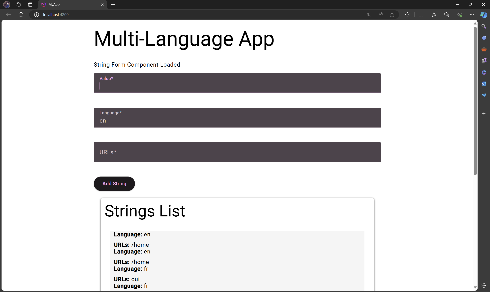
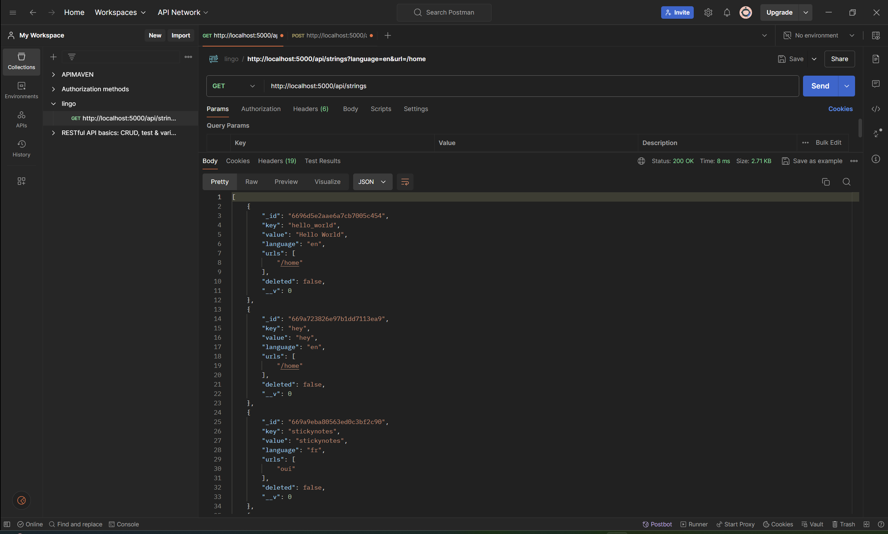
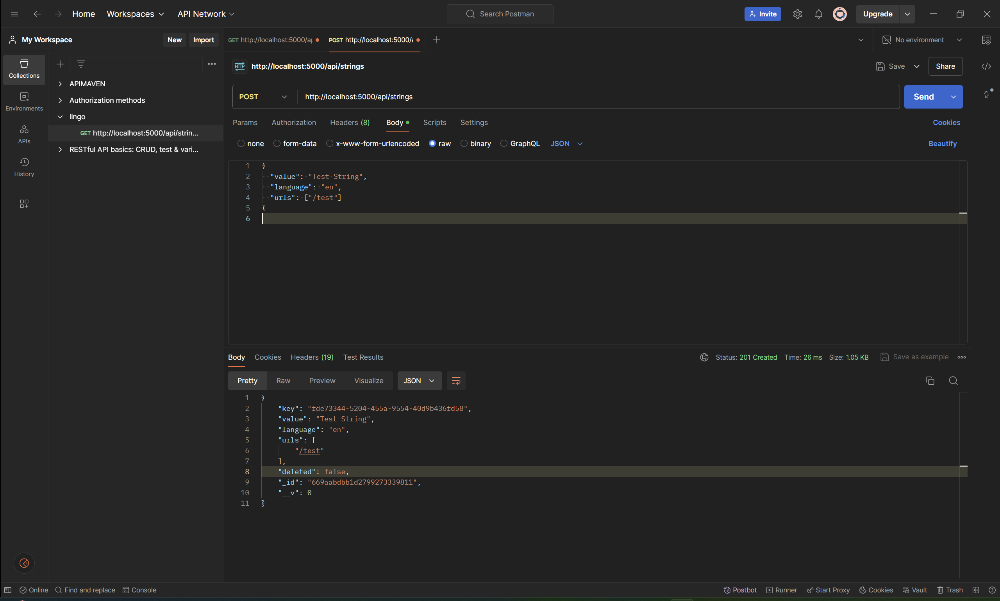

# LingoSwitch

The Lingo Switch project aims to create a centralized repository for managing strings (language) used across multiple projects along with their related URLs. This approach eliminates the need to hardcode strings, supports multilingual functionality, and allows for easy updates without recompiling the application.

## Features

- Add new strings with associated language and URLs.
- View a list of all strings with their details.
- Manage strings (add, update, mark as deleted).
- Track string modifications with timestamps and user details.

## Technologies Used

- **Frontend**: Angular 17, Angular Material
- **Backend**: Node.js 20, Express.js
- **Database**: MySQL
- **Styling**: Angular Material, CSS

## Getting Started

### Prerequisites

- Node.js
- MySQL
- Angular CLI

## Setup Instruction:

1. Clone repo
   ```bash
   git clone https://github.com/jo-walker/LingoSwitch.git
   ```
2. Navigate to app root dir and install dependencies:
   ```
   npm install
   ```
3. start the server
   ```
   npm start

## API Documentation:

### Endpoints
1. Get all strings:`GET /api/strings`
URL: /api/strings
Method: GET
Description: Retrieve all strings from the database.

2. Add a new string:`POST /api/strings`
URL: /api/strings
Method: POST
Description: Add a new string to the database.
Request Body:
{
  "value": "Hello World",
  "language": "en",
  "urls": ["/home"]
}


## Screenshots
### Web UI

### Postman GET request


### Postman POST Request

- better layout/design
- responsiveness
- angular material for css

## Security
- implemented env vars for sensitive info
- use authentication and authorization


## Handling Requirements
### Central Repository of Strings
##### Implementation: Developed a backend API to manage strings, allowing for CRUD operations on string entries.
- Details: Strings are stored in a relational database, enabling updates and retrievals without code recompilation.
### Project Management
#### Implementation: Created a table structure to manage multiple projects, including user access control.
- Details: Each project has associated users with role-based access to the string repository. Implemented authentication with username and password protection.
### Languages and Key-Naming
#### Implementation: Implemented a table for language definitions and used automatic key-naming for string entries.
- Details: Keys are generated in the format S_1, S_2, etc., and are associated with multiple languages. This allows for a common reference key for different language translations.
- Example: For the string “First Name,” the key S_1 maps to “Prenom” in French.
### URL Association
#### Implementation: Added functionality to track and associate strings with specific URLs.
- Details: Each string can be tagged with one or more URLs where it is used, ensuring consistent use across different pages and components.
### String Editing and URL Management
#### Implementation: Developed an interface for editing strings and managing URL associations.
- Details: The GUI allows users to update string translations and link multiple URLs to a single key, ensuring consistent string usage across all related pages.
### Search and View Strings
#### Implementation: Implemented a searchable interface in the GUI for viewing and finding strings by language.
- Details: Users can search by language and key to quickly locate and manage strings. Added filters to streamline the search process.
### Key Management
#### Implementation: Ensured that keys are permanent and not deprecated.
- Details: Once a key is created, it remains in the database, ensuring that historical data is preserved and references remain valid.
### Bonus – Modification Tracking
#### Implementation: Added functionality to track modifications, including timestamps and user details.
- Details: Implemented an audit trail that records when and by whom each string was modified, providing transparency and accountability.

## Contributing
Feel free to open issues or submit pull requests for any improvements or bug fixes.