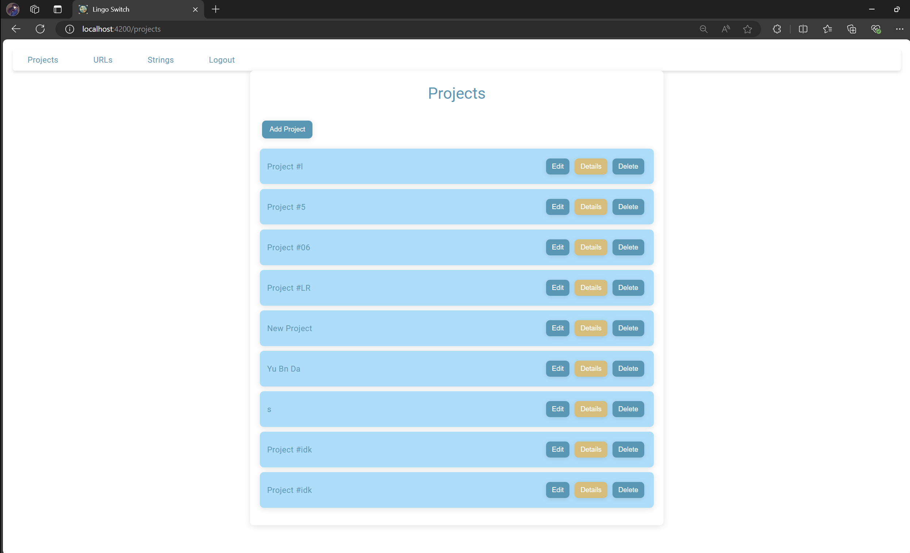
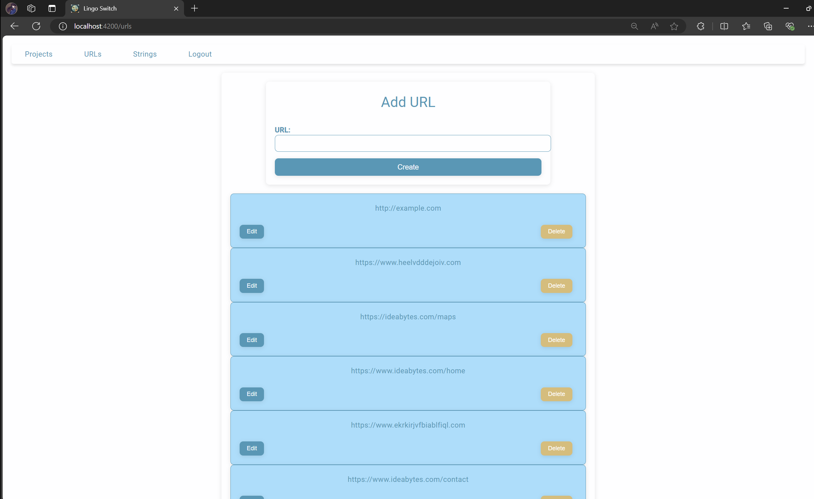
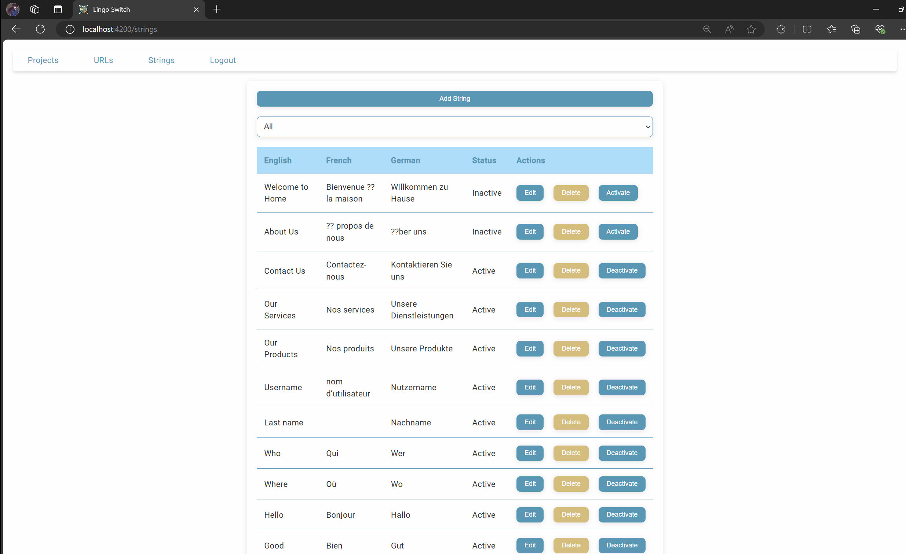

# LingoSwitch-Multi-Language String Management System

## Project Overview
The Lingo Switch aims to create a centralized repository for managing strings (language) used across multiple projects along with their related URLs. The system enables developers to define and manage strings for multiple languages, ensuring that strings do not have to be hardcoded into the system. This solution supports efficient string management across multiple projects and provides an interface to dynamically add, update, and toggle the visibility of strings (active/inactive).

## Features

- **Multi-Language Support:** Manage strings in multiple languages, such as English, French, and German.
- **Project-Based Management:** String keys are organized by project and can be associated with specific URLs.
- **Dynamic String Management:** Add, edit, and delete strings from a centralized system, preventing hardcoding.
- **String Status Toggling:** Mark strings as active or inactive without deleting them, controlling visibility without removal.
- **Security:** Role-based access to the system, authenticated via username and password.
- **History Tracking:** Track when strings were created, updated, and deleted, along with the user responsible for the action.
- **Bonus Features:** JSON compressed output for string queries to optimize bandwidth usage.

## Table of Contents

1. [Installation and Setup](#installation-and-setup)
2. [Technology Stack](#technology-stack)
3. [System Design](#system-design)
   - [Database Structure](#database-structure)
   - [API Endpoints](#api-endpoints)
4. [UI Design](#ui-design)
5. [Functionality](#functionality)
   - [Add/Update/Delete Strings, Projects, and URLs](#addupdatedelete-strings-projects-and-urls)
   - [Toggle String Status](#toggle-string-status)
   - [Filter Strings](#filter-strings)
6. [Usage](#usage)
   - [Adding Projects](#adding-projects)
   - [Managing Strings](#managing-strings)
   - [Querying Strings by URL](#querying-strings-by-url)
7. [Security](#security)
8. [Testing and Debugging](#testing-and-debugging)
9. [Future Enhancements](#future-enhancements)
10. [Contributing](#contributing)
11. [License](#license)

## Technologies Used

- **Frontend:** Angular 17, Angular Material, SCSS
- **Backend:** Node.js 20, Express.js, Sequelize
- **Database:** MySQL
- **Authentication:** JWT (JSON Web Tokens)

## Installation and Setup

### Prerequisites

- Node.js
- MySQL
- Angular CLI

### Setup Instructions

1. Clone the repository:
   ```bash
   git clone https://github.com/jo-walker/LingoSwitch.git

   ```
2. Navigate to app root dir and install dependencies:
   ```
   npm install
   ```
3. start the server
   ```
   npm start

## API Documentation:

### Endpoints
1. Get all strings:`GET /api/strings`
URL: /api/strings
Method: GET
Description: Retrieve all strings from the database.

2. Add a new string:`POST /api/strings`
URL: /api/strings
Method: POST
Description: Add a new string to the database.
Request Body:
{
  "value": "Hello World",
  "language": "en",
  "urls": ["/home"]
}
## System Design

### Database Structure

#### Projects Table:
- `id:` Primary key (manual autoincrementation in the server logic)
- `name:` Project name
- `languages:` Array of supported languages
- `history:` JSON object tracking creation and updates

+-----------+--------------+------+-----+---------+-------+
| Field     | Type         | Null | Key | Default | Extra |
+-----------+--------------+------+-----+---------+-------+
| id        | varchar(5)   | NO   | PRI | NULL    |       |
| name      | varchar(255) | NO   |     | NULL    |       |
| languages | json         | NO   |     | NULL    |       |
| history   | json         | YES  |     | NULL    |       |
+-----------+--------------+------+-----+---------+-------+

#### Strings Table:
- `id:` Primary key (auto-incremented)
- `urlId:` Foreign key to associate with URLs
- `eng_us:` English string
- `fr:` French string
- `de:` German string
- `active:` Boolean flag for string status (active/inactive)
- `history:` JSON object tracking changes to the string
+-----------+------------+------+-----+---------+----------------+
| Field     | Type       | Null | Key | Default | Extra          |
+-----------+------------+------+-----+---------+----------------+
| id        | int        | NO   | PRI | NULL    | auto_increment |
| urlId     | varchar(4) | YES  | MUL | NULL    |                |
| eng_us    | text       | YES  |     | NULL    |                |
| fr        | text       | YES  |     | NULL    |                |
| de        | text       | YES  |     | NULL    |                |
| userId    | int        | YES  | MUL | NULL    |                |
| projectId | varchar(5) | YES  | MUL | NULL    |                |
| history   | json       | YES  |     | NULL    |                |
| active    | tinyint(1) | YES  |     | 1       |                |
+-----------+------------+------+-----+---------+----------------+

#### URLs Table:
- `id:` Primary key (uses UUUI to achieve UXXX logical manual incremental logic)
- `url:` The URL where the string is used
- `history:` JSON object tracking changes to the uRL
+-----------+--------------+------+-----+---------+-------+
| Field     | Type         | Null | Key | Default | Extra |
+-----------+--------------+------+-----+---------+-------+
| id        | varchar(4)   | NO   | PRI | NULL    |       |
| url       | varchar(255) | NO   |     | NULL    |       |
| history   | json         | YES  |     | NULL    |       |
| projectId | varchar(5)   | YES  | MUL | NULL    |       |
+-----------+--------------+------+-----+---------+-------+

#### User table:
- `id:` Primary key (auto-incremented)
- `username:` username of the user
- `password` decrypted password
- `history:` JSON object tracking changes to the user info
+----------+--------------+------+-----+---------+----------------+
| Field    | Type         | Null | Key | Default | Extra          |
+----------+--------------+------+-----+---------+----------------+
| id       | int          | NO   | PRI | NULL    | auto_increment |
| username | varchar(255) | NO   | UNI | NULL    |                |
| password | varchar(255) | NO   |     | NULL    |                |
| history  | json         | YES  |     | NULL    |                |
+----------+--------------+------+-----+---------+----------------+

## API Endpoints

### Authentication
- `POST /api/auth/register`
- `POST /api/auth/login`

### Project Management
- `GET /api/projects`
- `POST /api/projects`
- `PUT /api/projects/:id`

### String Management
- `GET /api/strings`
- `GET /api/strings/:id`
- `POST /api/strings`
- `PUT /api/strings/:id`
- `PUT /api/strings/toggle-status/:id`
- `DELETE /api/strings/:id`

### URL Management
- `GET /api/urls`
- `POST /api/urls`
- `PUT /api/urls/:id`

### Compressed Querying API
- `GET /api/strings/compressed?url=<URL>&language=<lang_code>`: Returns compressed JSON data for efficient string retrieval.

## UI Design

The user interface is developed using Angular 17 with PrimeNG components for a modern and responsive experience. The UI supports the following:

- **Projects Page:** List all projects and allows adding new projects.
- **Strings Page:** Display all strings with a filter for active/inactive status. Strings can be added, edited, deleted, or toggled between active/inactive.
- **Responsive Design:** The layout adapts for smaller screens, ensuring usability across devices.
- **Design Style:** The interface uses a minimalist design with soft colors for readability and consistency.

## Screenshots

### Web UI



#### for more demo screenshots please refer to this directory: ../LingoSwitch/client/src/styles/

## Functionality

### Add/Update/Delete Strings
- Users can add strings in multiple languages.
- Existing strings can be updated or soft-deleted (marked inactive).
- String validation ensures no duplicate strings (case insensitive).

### Toggle String Status
- The status of strings can be toggled between active and inactive without deleting them from the database.

### Filter Strings
- A filter is provided on the UI to show All, Active, or Inactive strings based on user preference.

### Query Strings by URL
- Developers can query the string database via an API, fetching strings by URL and language in a compressed JSON format to optimize bandwidth.

## Usage

### Adding Projects
1. Navigate to the Projects page.
2. Click "Add Project" to define a new project and its supported languages.
3. Once the project is added, you can manage the associated strings and URLs.

### Managing Strings
1. Go to the Strings page.
2. Add new strings, specify their languages, and associate them with URLs.
3. Use the Status Filter to filter strings by active/inactive status.

### Querying Strings by URL
Developers can use the API to query strings by URL and language. The results will be returned in a compressed JSON format to optimize bandwidth.

## Security
- Authentication is implemented using JWT (JSON Web Tokens). Access to the system is secured via username and password. Only authenticated users can create, update, and delete projects or strings.
- Environment variables are used to handle sensitive data.

## Testing and Debugging
- Error handling and validations are integrated into both the frontend and backend.
- Debugging and testing were performed using Postman to validate API responses.

## Future Enhancements

- **Role-Based Access Control (RBAC):** Implement user roles to restrict access to certain parts of the system.
- **String Categorization:** Enable categorization of strings for better management.
- **Translation Automation:** Integrate automatic translation APIs to suggest translations for missing language fields.
- **UI Design:** Continue to refine the user interface for a more professional appearance and enhanced accessibility.

## GitHub workflow:
- Branching: Utilized feature branches for individual tasks and features. Merged completed branches into the default branch after testing to ensure a clean and stable codebase.
- Deployment: Managed deployment on the default branch after successfully merging feature branches.
- Project Dashboard: Used GitHub's Project Dashboard to track tasks, manage the backlog, and prioritize work. - This helped stay on top of tasks that are required.

## Conclusion
Overall, I conclude the project achieves the goal of the task and may need enhancements for UI, advanced security features, and DB schema that can store more than 3 languages. 

## Contributing

Contributions are welcome! Please feel free to submit a pull request or file an issue if you encounter any bugs or have suggestions for improvements.

1. Fork the repository.
2. Create a new branch (`git checkout -b main`).
3. Make your changes.
4. Submit a pull request.